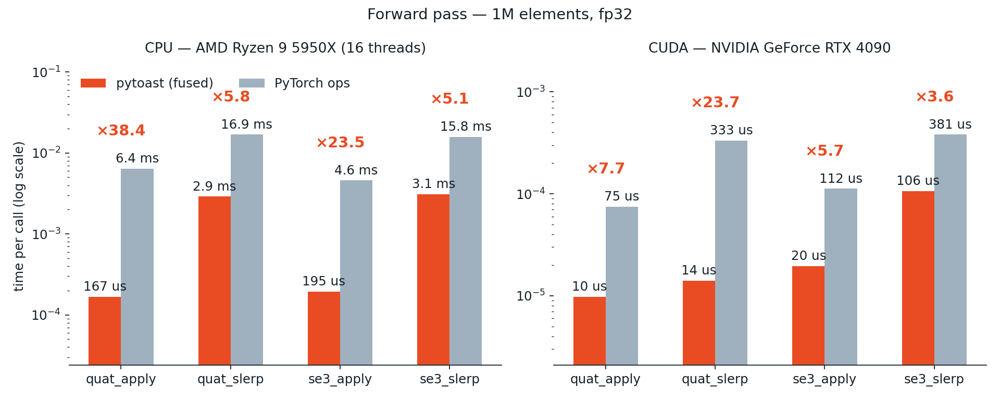

<div align="center">


**py**Torch **A**ccelerated **S**patial **T**ransforms

[](LICENSE)
[](https://npatakin.github.io/pytoast/)
[](https://pytorch.org)
[](#performance)
[](#tests)

</div>

---

pytoast is an efficient PyTorch C++/CUDA extension for spatial transforms — quaternions, rigid
transforms, operations with velocities and trajectories. Every operation is one fused pre-compiled kernel,
not a chain of elementwise ops.

- **Fused on both CPU and CUDA.** CPU operations support multi-threading, while CUDA operations are fused into a single kernel, providing up to `10x` speed-ups over plain PyTorch implementations.
- **Differentiable.** Every operation produces gradients w.r.t. all floating-point arguments. 
- **Multiple dtypes.** By default, compiles with both `float` and `double` dtype kernels. 
- **Batch dimensions with broadcasting.** The library supports an arbitrary number of batch dimensions that follow PyTorch broadcasting semantics. 
- **Native support for non-contiguous tensors.** * No `.contiguous()` calls when tensors have non-contiguous batch dimensions or broadcasting is performed. Saves lots of memory and computation time. 
- **Object-oriented wrappers** `Quat`, `SE3`, `LinearMotion` structures with built-in support for all PyTorch operations: indexing, slicing, `cat`, `stack`, broadcast, movement across devices and dtypes. If you prefer, you are still free to choose functional-style operations.
- **A pure-PyTorch reference for every op**, switchable at runtime. You can debug with readable stack traces, or check the kernels against it.
- **Header-only C++/CUDA math** for your own extensions, backwards included.
- **Easy to implement custom ops.** You can easily extend `toast` with your own operation in just a few lines of code — no boilerplate required. 

\* Tensors with a non-contiguous last (fixed-size) dimension are still cast to contiguous tensors. 
E.g. operations with a quaternion tensor of shape `[B, K, 4]` natively handle non-contiguous `B` and `K` dimensions, 
but if the `4` dimension has `stride != 1`, the tensor is copied. This is required for efficiency.

Short benchmark against pure-PyTorch implementation: 

<picture>
  <source media="(prefers-color-scheme: dark)" srcset="assets/bench-combined-forward-dark.png">
  
</picture>

## Install

The build compiles a C++/CUDA extension against your existing environment, so it
needs:

- **PyTorch 2.x** already installed.
- **GCC/G++ with C++17 support**.
- **A CUDA toolkit with `nvcc`** matching your PyTorch build (tested on 12.6+) —
  only if you want the CUDA kernels. See [CPU-only](#cpu-only-install) below.

```bash
git clone https://github.com/npatakin/pytoast
cd pytoast
pip install --no-build-isolation .
```

If you are running build on a machine with low RAM to CPU cores ratio, you can limit number of compile processes 
to avoid running into out-of-memory situation:

```bash
MAX_JOBS=8 pip install --no-build-isolation .
```

Test the installation is successful with import:
```python
import toast
```

### CPU-only install

It is possible to build CPU-only version of library if no CUDA toolkit is present in the system. 
If no usable `nvcc` is found the build falls back to a CPU-only extension automatically, 
and prints which version it is building. C++17 compiler and pytorch installation are still required.

```bash
TOAST_CPU_ONLY=1 pip install --no-build-isolation .   # or just let it autodetect
```

You can check which version of `toast` is currently compiled:
```python
import toast

toast.has_cuda_support()   # False in a CPU-only build
```

`TOAST_FORCE_CUDA=1` forces the CUDA path if your toolkit lives somewhere the
autodetection misses.

## Operation coverage

Full API reference: [Documentation](npatakin.github.io/pytoast)

| | |
| --- | --- |
| **Quaternion** | `quat_apply`, `quat_apply_inv`, `quat_mul`, `quat_inverse`, `quat_conjugate`, `quat_std`, `quat_unit`, `quat_random`, `quat_slerp`, `quat_to_matrix`, `quat_from_matrix`, `quat_to_axis_angle`, `quat_from_axis_angle`, `quat_from_euler_angles`, `quat_from_xyzw` |
| **SE(3)** | `se3_apply`, `se3_apply_inv`, `se3_compose`, `se3_inverse`, `se3_slerp`, `se3_to_matrix_3x4`, `se3_to_matrix_4x4`, `se3_from_matrix` |
| **Motion** | `velocities`, `linear_velocity`, `angular_velocity`, `apply_velocity`, `apply_angular_velocity`, `linear_motion_transform` |
| **Interpolation** | `sample_trajectory` |


## A quick tour

### Rotations

`Quat` wraps a `(..., 4)` tensor of **wxyz** quaternions (real part first). `@` means "apply" — a
point tensor gets rotated, another `Quat` gets composed:

```python
q = Quat.random(1000)        # (1000,) rotations
p = torch.randn(1000, 3)     # (1000,) points

p_rot = q @ p                # rotate
q_two = q @ Quat.random(1000)  # compose
```

Rotation matrices, axis-angle vectors and Euler angles convert in both
directions (`to_matrix` / `from_matrix` and friends), and `inv`, `conj`, `lerp`
and the `angle` / `angle_deg` properties are there too.

A rotation is a **unit** quaternion, and the kernels take that as given —
applying one uses the unit-quaternion formula and does not renormalize, which is
part of where the speed comes from. Keeping the quaternion normalized is the
caller's responsibility: a non-unit quaternion will not raise, it will silently
scale the result. Use `normalize()`, or `std()` for unit norm plus the canonical
`w >= 0` sign.

### Rigid transforms

`SE3` is a rigid transform stored as a **unit** `Quat` plus a translation
vector, and the same normalization contract applies — the constructor takes the
quaternion as given. Composing and inverting preserve unit norm, but float error
accumulates, so renormalize if you chain many transforms. Name the frames in
your variables and composition reads itself:

```python
T_a_b = SE3(Quat.random(8), torch.randn(8, 3))
T_b_c = SE3(Quat.random(8), torch.randn(8, 3))

T_a_c = T_a_b @ T_b_c        # compose
points_a = T_a_c @ points_c  # transform points
```

`inv`, `lerp`, and conversion to and from 3×4 / 4×4 matrices work the same way.

### Structures behave like tensors

`Quat`, `SE3` and `LinearMotion` subclass `DataTensor`, which forwards shape and
device operations to every buffer they hold. `.shape` is the *batch* shape —
the fixed trailing dimension is not part of it:

```python
q = Quat.random(4, 8)

q.shape              # (4, 8), not (4, 8, 4)
q[:, 2:5]            # (4, 3)
Quat.stack([q, q])   # (2, 4, 8)
q.double(), q.cpu(), q.cuda()
```

Indexing, slicing, `cat`, `stack`, `reshape`, `permute`, and the usual
device/dtype moves all apply.

### Trajectories

A trajectory is a batch of timestamped SE(3) keyframes. `sample_trajectory`
brackets each query time and interpolates in one kernel — slerp for rotation,
lerp for translation — extrapolating linearly past the ends. Real logs have
gaps, so keyframes can be masked out: queries then interpolate between the
nearest *valid* neighbours, and the returned mask says which outputs to trust.

```python
out_q, out_t, valid, *_ = sample_trajectory(
    query_times,                  # (..., Q) timestamps to sample at
    seq_times, seq_quats, seq_t,  # (..., K) keyframes
    seq_mask=seq_mask,            # bad keyframes drop out of bracketing
    return_mask=True,
)
```

It optionally also returns per-segment linear and angular velocities, and the
indices of the keyframes each query landed between.

### Constant-velocity motion

`LinearMotion` is a pose, a pose timestamp, and constant linear and angular
velocities. It has convenient method to `fit` from a series of observations:

```python
motion = LinearMotion.fit(poses, times)
# evaluate at arbitrary timestamp now
motion.pose_at(query_time) # -> SE3 
```
`LinearMotion.apply_to_points` extrapolates the pose to every point's  timestamp and transforms it there:

```python
points_out = motion.apply_to_points(points, points_time)
```

Velocities themselves are also available directly, as `velocities` between two
timestamped poses and `apply_velocity` to integrate one forward.

### Gradients

Gradients flow through every operation.
`.data`:

```python
q = Quat.random(64).requires_grad_(True)

(q @ p).sum().backward()
q.data.grad # actual torch.Tensor storing data in Quat is called "data"
```

### Functional API

Every operation is also a plain function over tensors, listed in the coverage
table above — the wrappers are a convenience, not a requirement:

```python
from toast import quat_apply

p_rot = quat_apply(quat, points)     # (..., 4) and (..., 3) tensors
```


### Backends

Every operation dispatches through a registry, so the same code runs on the
fused kernels or the PyTorch reference:

```python
from toast import use_backend, set_backend

q_mid = q1.lerp(q2, t)             # 'cpp' — fused kernels, the default

with use_backend("torch"):
    q_mid = q1.lerp(q2, t)         # reference implementation, same result

set_backend("torch")               # or switch for the rest of the process
```

| Backend | What it is |
| --- | --- |
| `cpp` | Fused C++/CUDA kernels, on CPU and CUDA tensors alike. Default. |
| `torch` | Pure-PyTorch reference. Readable, differentiable, device-agnostic. |


## Using the math headers in your own kernels

The `quat` and `se3` structs are header-only and `__host__ __device__` — build
on them from your own extension instead of calling back into Python:

```python
import toast
toast.get_include_path()      # pass to include_dirs in your setup.py
```

```cpp
#include <toast/math/se3.h>

using se3_t = se3<Float32>;          // or se3<Float64>

__global__ void my_kernel(const float4* q, const float3* t, float3* p, int n) {
    const int i = blockIdx.x * blockDim.x + threadIdx.x;
    if (i >= n) return;
    p[i] = se3_t{se3_t::quat_t{q[i]}, t[i]}.apply(p[i]);
}
```

Each struct carries its analytic backward as static methods — `apply_backward`,
`compose_backward`, `slerp_backward` and friends — so a custom kernel can be
made differentiable without deriving anything by hand.


## Tests

To run cross-backend tests: 
```bash
python tests/run_tests.py
```

## License

Apache 2.0 — see [LICENSE](LICENSE).
